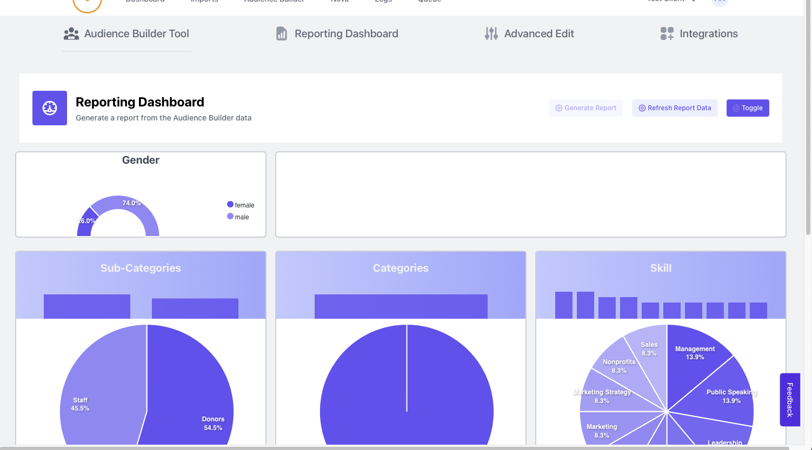

# Code Sharing

Two apps below. Adding a third shortly. 

The first one has been in use for months now and importing 100,000 of records. The later two will be projects that are being built right now.

With all of these comes the understanding of CI/CD at the core. With CI there is testing, code quality checking
auto deployment to staging and zero-downtime to production. You can get more info [here](https://alfrednutile.info/posts/ci_cd_part_one/) on how I start this off for projects. This article uses GithubActions since it really streamlines the work.

## TOC
  * [ElasticSearch integration Examples with Laravel, Livewire](#elasticsearch-integration-examples-with-laravel-livewire)
  * [Audience Builder - Bulk Edit UI](#audience-builder---bulk-edit-ui)
  * [Audience Builder using Livewire for a dynamic tool/dashboard](#audience-builder-using-livewire)
  * [Private Projects - examples of code and access to thoes repos since they are mine](#private-projects)
  * [Blog Posts](#blog-posts)
  * [Open Souce](#opens-source)

## ElasticSearch integration Examples with Laravel, Livewire

This shows dynamic charts using [https://apexcharts.com](https://apexcharts.com) and Elastic Search.



Here is some code examples of how I pulled that off.


When the Livewire component is mounted I call to the Facade / Client:

```php
    public function mount(AudienceBuilder $audience_builder)
    {
        $this->models_audience_builder = $audience_builder;

        $this->indexName = sprintf(
            "ab-%s",
            $this->models_audience_builder->id
        );

        $this->indexExists = ElasticSearchClient::indexExist(
            $this->indexName
        );
    }

```

This allows me to mock whent testing the UI with PHPUnit tests (which is great about LiveWire)

Then taht client talks to ElasticSearch:

To start with it used Dependency Injection:

```php
use Elasticsearch\Client;
use Illuminate\Support\Arr;
use Illuminate\Support\Facades\File;
use Illuminate\Support\Facades\Log;

class ElasticSearchClient
{
    protected Client $client;

    public function __construct(Client $client, $config = [])
    {
        if (!empty($config)) {
            $client = ClientBuilder::fromConfig($config);
        }

        $this->client = $client;
    }

```

And that can be `AppServiceProvider` class:

```php
     * @return void
     */
    public function register()
    {
        $this->app->bind(ElasticSearchClient::class, function () {
            $config = config("elastic");
            $config['hosts'] = Arr::wrap(
                Arr::get($config, 'hosts', [])
            );

            $client = ClientBuilder::create()->build();

            return new ElasticSearchClient($client, $config);
        });

        $this->app->bind(PDLAPIService::class, function () {
            return new PDLAPIService();
        });
```

Once there I can talk to ES (full code shared below), with a Repository class managing the business logic:

```php
<?php

namespace App\Services;

use App\Models\AudienceBuilder;
use App\Repositories\AudienceBuilder\ElasticSearchRepository;
use Elasticsearch\ClientBuilder;
use Elasticsearch\Client;
use Illuminate\Support\Arr;
use Illuminate\Support\Facades\File;
use Illuminate\Support\Facades\Log;

class ElasticSearchClient
{
    protected Client $client;

    public function __construct(Client $client, $config = [])
    {
        if (!empty($config)) {
            $client = ClientBuilder::fromConfig($config);
        }

        $this->client = $client;
    }

    public function getAggs($index_id)
    {
        $query = $this->aggs();
        $query = json_decode($query, true);
        $params = [
            'index' => $index_id,
            'body'  => $query
        ];

        $response = $this->client
            ->search($params);

        $results = Arr::get($response, 'aggregations', []);
        $results['hits'] = Arr::get($response, 'hits.total.value');

        return $results;
    }

    public function indexExist($index_id)
    {
        $params = [
            'index' => $index_id
        ];

        $response = $this->client
            ->indices()
            ->exists($params);

        return $response;
    }


    public function deleteIndex($index_id)
    {
        $params = [
            'index' => $index_id
        ];

        $response = $this->client
            ->indices()
            ->delete($params);


        $this->handleResponse(
            $response,
            'acknowledged',
            true,
        );

        return "ok";
    }

    protected function handleResponse(
        $response,
        $key,
        $result,
        $return = false
    ) {
        if (Arr::get($response, $key) != $result) {
            Log::info("ES Error", $response);
            throw new \Exception("Issue connecting to ES");
        }

        if ($return) {
            return Arr::get($response, $return);
        }

        return false;
    }

    public function createIndexWithMappings($index_id)
    {
        $mappings = $this->mappings();
        $mappings = json_decode($mappings, true);
        $params = [
            'index' => $index_id,
            'body'  => [
                'settings' => [
                    'number_of_shards' => 1,
                    'number_of_replicas' => 1
                ],
                'mappings' => Arr::get($mappings, 'mappings', [])
            ]
        ];

        $response = $this->client
            ->indices()
            ->create($params);

        $results = $this->handleResponse(
            $response,
            'acknowledged',
            true,
            'index'
        );


        return $results;
    }

    public function refreshIndex(AudienceBuilder $audienceBuilder)
    {
        $index_name = sprintf("ab-%s", $audienceBuilder->id);
        $this->deleteIndex($index_name);
        return $this->bulkImport($audienceBuilder);
    }

    public function bulkImport(AudienceBuilder $audienceBuilder)
    {

        $results = (new ElasticSearchRepository($audienceBuilder))
            ->getBulkInsertToText();

        $index_name = sprintf("ab-%s", $audienceBuilder->id);

        $this->createIndexWithMappings($index_name);

        $params = [
            'index' => $index_name,
            'body'  => $results
        ];

        $response = $this->client->bulk($params);

        $results = $this->handleResponse(
            $response,
            'errors',
            false
        );

        return "ok";
    }


    public function createIndex($index_id)
    {

        $params = [
            'index' => $index_id,
            'body'  => [
                'settings' => [
                    'number_of_shards' => 1,
                    'number_of_replicas' => 1
                ]
            ]
        ];

        $response = $this->client
            ->indices()
            ->create($params);

        $results = $this->handleResponse(
            $response,
            'acknowledged',
            true,
            'index'
        );


        return $results;
    }

    protected function getParams($index_id)
    {
        $config = config("elastic");
    }

    protected function mappings()
    {
        return <<<EOD
{
  "mappings": {
    "properties": {
      "experience": {
        "type": "nested" 
      },
      "education": {
        "type": "nested" 
      },
      "score_total": {
          "type": "integer"
      },
      "donation_total": {
          "type": "scaled_float",
          "scaling_factor": 100
      },
      "modifier": {
          "type": "integer"
      },
      "location_geo": {
          "type": "geo_point"
      },
      "skills": {
          "type": "keyword"
      },
      "category": {
          "type": "keyword"
      },
      "subcategory": {
          "type": "keyword"
      },
      "gender": {
          "type": "keyword"
      },
      "location_region": {
          "type": "keyword"
      },
      "job_title": {
          "type": "keyword"
      },
      "industry": {
          "type": "keyword"
      },
      "regions": {
          "type": "keyword"
      }
    }
  }
}
EOD;
    }

    protected function aggs()
    {
        return <<<EOD
{
  "size": 0,
  "aggs": {
    "avg_score": { "avg": { "field": "score_total" } },
    "plot_score": { "boxplot": { "field": "score_total" } },
    "plot_birth_year": { "boxplot": { "field": "birth_year" } },
    "donation_count": { "avg": { "field": "donation_count" } },
    "avg_donation": { "avg": { "field": "donation_total" } },
    "max_donation": { "max": { "field": "donation_total" } },
    "stats_donations": { "extended_stats": { "field": "donation_total" } },
    "stats_scores": { "extended_stats": { "field": "score_total" } },
    "max_birth_year": { "max": { "field": "birth_year" } },
    "gender": { "terms": { "field": "gender" }},
    "percentile_scores": { "percentiles": { "field": "score_total" }},
    "percentile_birth_year": { "percentiles": { "field": "birth_year" }},
    "terms_skills": { "terms": { "field": "skills" }},
    "terms_category": { "terms": { "field": "category" }},
    "terms_subcategory": { "terms": { "field": "subcategory" }},
    "terms_regions": { "terms": { "field": "regions" }},
    "terms_industry": { "terms": { "field": "industry" }},
    "terms_gender": { "terms": { "field": "gender" }},
    "terms_job_title": { "terms": { "field": "job_title" }},
    "terms_location_region": { "terms": { "field": "location_region" }},
    "geo_bounts_location_geo": {"geo_bounds":{ "field": "location_geo", "wrap_longitude": true } }
  }
}
EOD;
    }
}
```
This allows for separations in the following ways

  * Slim Controller to render the UI
  * Client Class using proper DI to talk to an API and in this case wrap the SDK provided.
  * Repository class to manage and business data.


## Audience Builder using Livewire 
This is a project to build a really impressive system around audience building.
They had a Poc that hit the PDL Api (https://www.peopledatalabs.com) but then I really took it to the next level.

Let me give you some examples.

Working from the UI I will show how this comes togther:


## Audience Builder - Bulk Edit UI

Here you can see an Advnaced Edit area to replace the customers need for AirTable.
This is all Livewire and MySQL and I will show the code in a moment:


### Starting with the "Controller"
Livewire acts as the route and the controller.
You can see a slim controller code here:

```php
<?php

namespace App\Http\Livewire;

use Livewire\Component;
use Livewire\WithPagination;
use App\Models\AudienceBuilder;
use Illuminate\Support\Facades\Log;
use App\Http\Livewire\Traits\WithBulkActions;
use App\Traits\AtlasNotifications;
use Facades\App\Repositories\AdvancedAudienceBuilderRepository;

class AdvancedAudienceBuilder extends Component
{
    use WithPagination;
    use WithBulkActions;
    use AtlasNotifications;

    public $abModelName = "models_audience_builder";

    public $first_time = true;

    public $filters = [
        'search' => '',
        'enriched_only' => true,
        'imports' => [],
        'job_titles' => [],
        'employers' => []
    ];

    protected $listeners = ['individualAdded', 'individualUpdated', 'refreshTable', 'filtersUpdated'];

    public $models_audience_builder;

    public function mount(AudienceBuilder $audience_builder)
    {
        $this->models_audience_builder = $audience_builder;
    }

    public function updatingFiltersSearch()
    {
        $this->resetPage();
    }

    public function filtersUpdated($filters)
    {
        Log::info("Before", $this->filters);
        $this->filters = array_merge($this->filters, $filters);
        Log::info("After", $this->filters);
    }

    public function refreshTable()
    {
        $this->atlasAlert("Table updated");
    }

    public function openEditModal($individual_id)
    {
        $this->emit("openModal", 'add-edit-individual', [
            'audienceBuilder' => $this->models_audience_builder,
            'individual' => $individual_id,
            'selected' => $this->selected,
            'filters' => $this->filters
        ]);
    }


    public function individualUpdated()
    {
        $this->atlasAlert("Individal Updated");
    }

    public function individualAdded()
    {
        $this->atlasAlert("Individual Added");
    }


    public function render()
    {
        $individuals = AdvancedAudienceBuilderRepository::paginate(20)
            ->setSearch($this->filters['search'])
            ->setEnrichedOnly($this->filters['enriched_only'])
            ->setImports($this->filters['imports'])
            ->setJobTitles($this->filters['job_titles'])
            ->setEmployers($this->filters['employers'])
            ->search($this->models_audience_builder);


        return view('livewire.advanced-audience-builder', [
            'individuals' => $individuals
        ]);
    }
}
```

This is key as breaking the UI into components makes building it, adding to it, and debugging it easier. 

### The Search Repository class

`AdvancedAudienceBuilderRepository`

Again DI or RealTime Facades I inject a class that makes it easy to mock the UI on it's own and the Repository class outside of the UI. This is key to making an application easy to change over time, maintain etc.


I will share that class below breaking it up with comments:

```php
<?php

namespace App\Repositories;

use App\Dtos\PDLEnrichmentDto;
use App\Models\Import;
use App\Models\Individual;
use Illuminate\Support\Str;
use App\Models\AudienceBuilder;
use App\Models\AudienceTag;
use Illuminate\Support\Facades\DB;
use Illuminate\Support\Facades\Log;
use Illuminate\Support\Facades\File;
use YlsIdeas\FeatureFlags\Facades\Features;
use Facades\App\Repositories\IndividualRepository;

class AdvancedAudienceBuilderRepository
{
    public $paginate;

    public $search = '';

    public $imports = [];

    public $jobTitles = [];

    public $enriched_only = true;

    public $employers = [];

    public function setSearch($search)
    {
        $this->search = $search;
        return $this;
    }

    public function setEnrichedOnly($state = true)
    {
        $this->enriched_only = $state;
        return $this;
    }


    public function setEmployers(array $employers)
    {
        $this->employers = $employers;
        return $this;
    }

    public function setJobTitles(array $jobTitles)
    {
        $this->jobTitles = $jobTitles;
        return $this;
    }

```
Lots of public attributes could be made protected. This is where "Red, Green, Refactor" could help me pay off this Technical Debt.

```php
    public function setImports(array $imports)
    {
        $this->imports = $imports;
        return $this;
    }

    public function paginate($paginate = 100)
    {
        $this->paginate = $paginate;
        return $this;
    }

    public function getFilters(AudienceBuilder $ab)
    {
        $filters = [
            'job_titles' => [],
            'employers' => []
        ];

        $imports = $ab->imports()->pluck("id");

        $filters['job_titles'] = DB::table("import_individual")
            ->select("individuals.job_title")
            ->leftJoin("individuals", "individuals.id", "import_individual.individual_id")
            ->whereIn("import_individual.import_id", $imports)
            ->distinct()
            ->orderBy("job_title")
            ->pluck('job_title')->toArray();

        $filters['employers'] = DB::table("import_individual")
            ->select("individuals.employer")
            ->leftJoin("individuals", "individuals.id", "import_individual.individual_id")
            ->whereIn("import_individual.import_id", $imports)
            ->distinct()
            ->orderBy("employer")
            ->pluck('employer')->toArray();


        return $filters;
    }
```
This is a query to get dynamic filters you are seeing in the UI.

These could be cached to speed up the process. This is a "Skateboar" approach and 
this feature was one of the later ones I made and would come back to optimizie here.


```php

    public function updateIndividualInAb(
        Individual $individual,
        AudienceBuilder $audienceBuilder,
        $tags = []
    ) {
        $individual->save();

        if (!empty($tags)) {
            foreach ($audienceBuilder->imports as $import) {
                $import->individuals()->detach($individual->id);
            }
            $import = $this->addImport($audienceBuilder, $individual);
            $this->addTags($import, $tags);
        }

        return $individual->refresh();
    }

    public function addIndividualToAb(
        Individual $individual,
        AudienceBuilder $audienceBuilder,
        $tags = []
    ) {
        if (!$individual->id) {
            if (!$individual->enrichment) {
                $dto = IndividualRepository::makeDtoFromIndividual($individual);
                $individual->enrichment = $dto->toArray();
                $individual->enriched = false;
            } else {
                //make proper enriched user
                $dto = new PDLEnrichmentDto($individual->enrichment);
                $individual = Individual::makeInstance($dto);
            }
            $individual->save();
        }

        $import = $this->addImport($audienceBuilder, $individual);

        if (empty($tags)) {
            $tags = [AudienceTag::manual()->id];
        }

        $this->addTags($import, $tags);

        return $individual;
    }

```
Here I modify the indiviual as the "modal" ui sends back a response to the Repository class. I am using the Spatie Data Transfer Obeject library to help make sure the data in and our lines up with what is required.

```php

    protected function addTags($import, $tags)
    {
        AudienceTag::addTags($import, $tags);
    }

    protected function addImport(AudienceBuilder $audienceBuilder, Individual $individual)
    {
        $import_name = sprintf(
            "Manual Import for Individual %s %s",
            $individual->first_name,
            $individual->last_name
        );

        $import = Import::makeManual(
            $audienceBuilder,
            auth()->user(),
            auth()->user()->currentTeam->id,
            $import_name
        );

        $import->individuals()->syncWithoutDetaching(
            [$individual->id]
        );

        return $import;
    }

```

Allow user to tag the data, note how I abstracted that class out into it's own responsiblity.

```php

    /**
     * @see app/Exports/AudienceBuilderForMLExport.php
     */
    public function search(AudienceBuilder $ab)
    {
        if (!empty($this->imports)) {
            $imports = $this->imports;
        } else {
            $imports = $ab->imports->pluck('id');
        }

        // /*+ SET_VAR(sql_mode='STRICT_TRANS_TABLES') */
        $results = Individual::query()->select(
            DB::raw("
    individuals.id,
    individuals.enriched,
	individuals.first_name AS first_name,
	individuals.middle_name AS middle_name,
	individuals.last_name AS last_name,
    individuals.job_title AS job_title,
	individuals.employer AS employer,
	individuals.street_address_1 AS street_address_1,
	individuals.street_address_2 AS street_address_2,
	individuals.city AS city,
	individuals.state AS state,
	individuals.postal_code AS postal_code,
	individuals.postal_plus AS postal_plus,
	individuals.primary_email AS primary_email,
	individuals.email_two AS email_two,
	individuals.email_three AS email_three,
	individuals.email_four AS email_four,
	individuals.email_five AS email_five,
	individuals.email_six AS email_six,
	individuals.phone_one AS phone_one,
	individuals.phone_two AS phone_two,
	individuals.phone_three AS phone_three,
	individuals.birth_date AS birth_date,
	individuals.age AS age,
	individuals.gender AS gender,
	individuals.linkedin_id AS linkedin_id,
	individuals.linkedin_url AS linkedin_url,
	individuals.twitter_id AS twitter_id,
	individuals.twitter_url AS twitter_url,
	individuals.twitter_handle AS twitter_handle,
	individuals.facebook_id AS facebook_id,
	individuals.facebook_url AS facebook_url,
	individuals.original_id AS original_id,
	GROUP_CONCAT(DISTINCT category.name) AS category,
	GROUP_CONCAT(DISTINCT audience_tags.name) AS subcategory,
	SUM(audience_tags.score) as score_total")
        )->leftJoin('import_individual', 'import_individual.individual_id', '=', 'individuals.id')
            ->leftJoin('taggables', 'taggables.taggable_id', '=', 'import_individual.import_id')
            ->leftJoin('audience_tags', 'audience_tags.id', '=', 'taggables.audience_tag_id')
            ->leftJoin('audience_tags as category', 'category.id', '=', 'audience_tags.parent_id')
            ->orWhere(function ($query) use ($imports) {
                foreach ($imports as $import) {
                    $query->orWhere('import_individual.import_id', '=', $import);
                }
            })
            ->when(!empty($this->employers), function ($query) {
                $query->where(function ($query) {
                    foreach ($this->employers as $filter) {
                        $query->orWhere("individuals.employer", "LIKE", $filter);
                    };
                });
            })
            ->when(!empty($this->jobTitles), function ($query) {
                $query->where(function ($query) {
                    foreach ($this->jobTitles as $jobTitle) {
                        $query->orWhere("individuals.job_title", "LIKE", $jobTitle);
                    };
                });
            })
            ->when($this->enriched_only, function ($query) {
                $query->where("individuals.enriched", '=', 1);
            })
            ->where('taggable_type', '=', 'App\\Models\\Import');

        if ($this->search && Str::length($this->search) >= 3) {
            $results = $results->where(function ($query) {
                $query->orWhere("first_name", "LIKE", "%$this->search%")
                    ->orWhere("last_name", "LIKE", "%$this->search%");
            });
        }

        $results = $results->groupBy("individuals.id")
            ->orderBy("individuals.last_name", "DESC");

        if (Features::accessible('advanced_query')) {
            File::put(base_path("tests/fixtures/advanced_individuals.txt"), $results->toSql());
        }

        return $results->paginate($this->paginate);
    }
}
```

This was a more complex query to I mixed the Laravel options here and note too that I pass the query variables properly to prevent SQL Injection.


### Livewire 
This is my first use of a well known library that makes it so you can make dynamic websites with little to no
JS. It has a backend rendering of JS which right now is really popular even in the Ruby on Rails community (how they
build the Hey.com app). So it is JS but as a developer you are writing and testing PHP.

I made numerous complex widgets to make a UI that was dynamic and increased usbility. 

Here is the ui will share the code right after this


What you are seing is the user able to quickly find what the API calls "terms" to search their api for a person.
Then when the user presses search and API search happens in the background deliving results to the lower area there without a refresh of the screen. 

This is a Trait so the class that drives the AudienceBuilder UI is made a bit smaller and easier to read. 
There are a lot of public methods but 
```php
<?php

namespace App\Http\Livewire\Traits;

use App\DataTargets\PDL;
use Illuminate\Support\Arr;
use Illuminate\Support\Facades\Log;
use Illuminate\Support\Str;

trait SearchBuilder
{
    public $filters = [];

    public function clearFilters()
    {
        $this->filters = [];
    }

    public function refreshTerms()
    {
        $this->terms = $this->getMappingFields('terms');
    }

    public function removeFilter($filter)
    {
        $this->filters = collect($this->filters)->filter(
            function ($value, $key) use ($filter) {
                return $value != $filter;
            }
        )->values()->toArray();
    }

    public function renderSearch()
    {
        return implode(" ", $this->filters);
    }

    public function saveFilter()
    {
        if ($this->search != "") {
            $this->filters[] = $this->search;
            $this->search = "";
        }
        $this->refreshTerms();
    }

    public function submitClicked()
    {
        $this->saveFilter();
        $this->liveSearch();
    }

    public function addToFilters($filters)
    {
        $filters = Arr::wrap($filters);

        $this->filters = collect($this->filters)
            ->merge($filters)->values()->toArray();
        $this->emit("connectionClicked");
    }

    public function addToSearch($term, $replace = false)
    {
        $this->search = trim($term . ":");
        $this->emit("addedToSearch");
    }

    public function updatedSearch()
    {
        if (Str::length($this->search) < 1) {
            $this->refreshTerms();
        } elseif (!Str::contains($this->search, ":")) {
            $terms = collect($this->all_terms)->filter(
                function ($value, $target_key) {
                    return Str::contains($value, $this->search);
                }
            )->unique()->values()->all();

            $this->terms = $terms;
        }
    }

    public function getAllTermsProperty()
    {
        return PDL::getAllTerms();
    }


    public function searchOptions()
    {
        if ($this->search_option == "clearSearch") {
            $this->reset('search', 'filters');
        } elseif ($this->search_option == "openIndexModal") {
            $this->emit('openModal', 'audience-builder-index');
        } elseif ($this->search_option == 'showFilters') {
            $this->show_filters = true;
        } elseif ($this->search_option == 'createMode') {
            $this->emitTo('livewire-toast', 'show', 'Redirecting you back one moment.');
            return redirect(route("audience.builder.create"));
        } elseif (is_numeric($this->search_option)) {
            session()->flash('livewire-toast', sprintf('Redirected to Audience Builder %d', $this->search_option));
            return redirect(route("audience.builder.edit", ['audience_builder' => $this->search_option]));
        }
    }
}

```

Couple of notes

```php
    public function getAllTermsProperty()
    {
        return PDL::getAllTerms();
    }
```

That is just a static method to get some enum like data out of a class that I use in a few places.


and then 

```php
 $this->emit("addedToSearch");
```
and

```php
 $this->emit("connectionClicked");
```

Are how the Trait can talk to the parent components. Since this large page is really broken down into many components.

From there I will go into the part that talks to the API for those results to show up as seen in the Gif.


```php
    public function liveSearch()
    {
        $this->reset("results");

        $filters = collect($this->filters)->filter(function ($value, $key) {
            return $value != null;
        })->values()->toArray();

        $results = PdlAutocomplete::setExists($this->exists)
            ->searchFilters($filters);

        $this->results = $results;

        $this->refreshStats();
    }
```
Here is when the Livewire class kicks off the search. There are two ways we search with the api. One is to search for a user another is to import a file. I will show shortly the parrallel processing I do to make the importing of 1000's of records happen in less than 2 minutes.

>NOTE: I am using Laravel real-time Facades which are 100% mockable and testable. `PdlAutocomplete::setExists($this->exists)`


This calls to the class `PdlAutocomplete`

which then uses this function to get results form the api

```php
public function searchFilters($payload = [], $scroll_token = false)
    {
        if ($scroll_token) {
            $this->scroll_token = $scroll_token;
        }

        $payload = $this->covertFromArrayToSearchableArray($payload);

        $wrapper = $this->generateWrapperAndBasedMatch($payload);

        $this->results = PDLAPIService::make()->search($wrapper);

        $status = $this->getStatus();

        if ($status == 404) {
            $this->results = [
                'data' => [],
                'total' => 0
            ];
        }
        return $this->results;
    }
```

Note eparations of concerns here. The UI class does not do much but ask for something, the glue class (handles business logic) calls the api but does not really know how to do it, and the client I made. Again can be mocked and neatly calls the api and returns simple results. 

Also this API has pagination since so I have to pass it a scroll token.

Let' dig into the class that talks to the API `PDLAPIService::make()->search($wrapper);`

Again not static but a Facade read more [here](https://laravel.com/docs/8.x/facades#real-time-facades)

This is a great patter for easy to mock and read code. Just like Dependency Injection but imo just a bit easier to seewhat is happening and mock. For example below I can mock the class as I write the `PdlAutocomplete` since I already know the `PDLAPIService` and at that point it is about data in and out of the object.

```php

public function test_is_ok_with_multi_key()
    {
        PDLAPIService::shouldReceive("make")->andReturnSelf();
        PDLAPIService::shouldReceive("search");
        $filters = [
            "job_title:Nurse",
            "job_title:Doctor",
            "job_title:Health",
            "location_country:Mexico"
        ];

        PDLAPIService::shouldReceive("search")
            ->withArgs(function ($input) {
                $term = Arr::get($input, 'query.bool.must.0.term');
                $name = Arr::get($term, 'job_title', []);
                if (count($name) != 3) {
                    return false;
                }
                return true;
            });


        $results = PdlAutocomplete::searchFilters($filters);
    }
```

Here in the `PDLAPIService` I talk to the API.

```php 
<?php

namespace App\Services;

use Exception;
use Illuminate\Support\Facades\Http;
use Illuminate\Support\Facades\Log;
use Illuminate\Http\Client\PendingRequest;
use Illuminate\Http\Client\RequestException;
use Illuminate\Http\Client\Response;
use Illuminate\Support\Str;
use Illuminate\Support\Arr;
use Illuminate\Support\Facades\File;
use YlsIdeas\FeatureFlags\Facades\Features;

class PDLAPIService
{
    protected $api_token;

    protected $pdl_version = "v5";

    protected $api_url = "https://api.peopledatalabs.com";

    protected $method = "post";

    protected $root_url = "person/search";

    protected $status = null;

    /**
     * @var Response $response
     */
    public $response;

    public function __construct()
    {
        $this->api_token = config('services.pdl.token');

        $this->checkSettings();
    }

    public function getApiToken()
    {
        return $this->api_token;
    }

    public function setApiToken($token)
    {
        $this->api_token = $token;
        return $this;
    }

    public static function make()
    {
        $token = config('services.pdl.token');

        if (Features::accessible("user_tokens")) {
            $token = auth()->user()->pdl_token ?? config('services.pdl.token');
        }

        $client = app()->make(self::class)->setApiToken($token);
        return $client;
    }

    public function sendRequest(array $payload, $service_url = "person/bulk", $attach_query_string = true)
    {
        $url = $this->createUrl($service_url, $attach_query_string);

        return
            $this->buildRequest()
            ->{$this->method}(
                $url,
                $payload
            );
    }


    public function isSuccess($response_row): bool
    {
        if (Arr::get($response_row, 'status') === 200) {
            return true;
        }
        return false;
    }


    public function autocomplete(array $payload)
    {
        $url = $this->createUrl(
            "autocomplete",
            $attach_query_string = false
        );


        $results = $this->buildRequest()
            ->get($url, $payload);

        $this->status = $results->status();


        return $results->json();
    }


    public function search(array $payload, $size = 40)
    {

        $url = $this->getUrl();

        $payload = json_encode($payload);

        try {
            $results = $this->buildRequest()
                ->withBody($payload, "application/json")
                ->get($url);

            $this->status = $results->status();

            return $results->json();
        } catch (RequestException $e) {
            $this->status = $e->response->status();
            return $e->response->json();
        }
    }

    public function searchReturnResponse(array $payload, $size = 40): Response
    {
        $url = $this->getUrl();

        $payload = json_encode($payload);

        try {
            $response = $this->buildRequest()
                ->withBody($payload, "application/json")
                ->get($url);
            return $response;
        } catch (RequestException $e) {
            Log::info("Error code", [$e->response->status()]);
            return $e->response;
        }
    }

    /**
     * @TODO
     * This is digging too deep into the import
     */
    public function createUrl($suffix, $attach_query_string = true)
    {
        $query_string =  ($attach_query_string) ? Str::start($this->getQueryString(), "?") : null;

        return sprintf(
            "%s/%s/%s%s",
            $this->api_url,
            $this->pdl_version,
            $suffix,
            $query_string
        );
    }

    public function setRootUrl($root_url)
    {
        $this->root_url = $root_url;
        return $this;
    }

    public function getStatus()
    {
        return $this->status;
    }

    public function getQueryString(): string
    {
        $items = [
            'titlecase=true'
        ];

        return implode("&", $items);
    }

    public function checkSettings()
    {
        if (!$this->api_token) {
            throw new Exception("Must have PDL token");
        }
    }

    protected function buildRequest(): PendingRequest
    {
        $ms = $this->getMiliseconds();

        if (Features::accessible("user_tokens")) {
            if (!$this->api_token) {
                $this->api_token = config('services.pdl.token');
            }
        } else {
            $this->api_token = config('services.pdl.token');
        }

        Log::info("API Token making requeat with", [$this->api_token]);

        return Http::withHeaders(
            [
                'X-Api-Key' => $this->api_token,
                "Accept-Encoding" => "gzip",
                'Content-Type' => 'application/json',
            ]
        );
    }


    protected function getUrl()
    {
        return
            $this->createUrl(
                $this->root_url,
                false
            );
    }

    protected function getMiliseconds()
    {
        if (app()->environment('testing')) {
            return 0001;
        }

        return 2000;
    }
}

```

NOTE: `Features::accessible("user_tokens")` that is a feature flag library in use.

The `public` functions are being used and I try to minimize these. Maybe this one could have had less.

Let's look at the same App but when the user does a CSV upload. I will show how I parse it as quickly as possible and hit the api but at the same time try not to get use to overuse the api and get throttled by them.


This pops up to enable the user to import a CSV file and tag the data.

When done the code:

```php
    public function uploadFile()
    {
        $import = AudienceBuilderRepository::createCsvRelatedImport(
            $this->audienceBuilder,
            $this->fileupload,
            $this->tags_chosen,
            $this->name
        );
        $this->import = $import;
        $this->step = "source_mapping";
    }
```
Send the request to this Facade without refreshing the page the user is notified it all happened.

see the Gif below


This shows Horizon, a great queue UI to Redis parsing as many rows of data I can throw at it. And then hitting the api in chunks of 100. (will show code in a moment)

Here is the code that takes over from `AudienceBuilderRepository` above.


The method will create and `Import` model but not run the real import (this is in the background)

```php
    public function createCsvRelatedImport(
        AudienceBuilder $audienceBuilder,
        UploadedFile $file,
        $tags = [],
        $name = null
    ) {
        $import = new Import();
        $file_name = $file->getClientOriginalName();

        $import->name = ($name) ?: sprintf(
            "Import related to Audience Builder %s file %s",
            $audienceBuilder->id,
            $file_name
        );

        $import->options = ["pdl" => ["required" => "emails or phone_numbers"]];
        $import->audience_builder_id = $audienceBuilder->id;
        $import->team_id = auth()->user()->currentTeam->id;
        $import->local_mappings = []; //hmm not sure I need these anymore since using DTO lets see
        $import->source_mappings = []; //next step
        $import->reimport = true;
        $import->user_id = auth()->user()->id;
        $import->source_id = Source::csvImport()->id;
        $import->target_id = Target::pdlEnrichment()->id;
        $import->status = Import::STATUS_PENDING_MAPPING;
        $import->file_path = $file_name;
        $import->save();

        $file->storeAs(
            strval($import->id),
            $file_name,
            "imports"
        );

        $mappings = CSV::model($import)->mappedWithCsv();
        $import->source_mappings = $mappings;
        $import->save();

        AudienceTag::addTags($import, $tags);

        $import->refresh();

        return $import;
    }
```

From here an Event is triggered and a job starts to parse the file.

```php
   public function verifyImport()
    {
        AudienceBuilderRepository::triggerCsvImport($this->import);

        $this->closeModalWithEvents([
            "importFromCsvKickedOff"
        ]);
    }
```
This gives the user a moment to verify the running of the job (soon to just happen without this verification)

```php
    public function triggerCsvImport($import)
    {
        $import->status = Import::STATUS_PENDING_REVIEW;

        $import->save();
        $import->refresh();
        Log::info("Created Import related to Audience Builder");
        dispatch(new AudienceBuilderTriggerImportJob($import));

        return $import;
    }
```

From here the job `AudienceBuilderTriggerImportJob` does some cool stuff in the background to break this up into `chunks`

First it updates the status of the `Import` and second it puts in into the shared job `chunker`

```php
    /**
     * Execute the job.
     *
     * @return void
     */
    public function handle()
    {
        $this->import->reimport = true;
        $this->import->status = Import::STATUS_IN_PROGRESS;
        ImportsKickOffJob::dispatch($this->import->refresh())->onQueue('chunk_data');
    }
```

This is shared by any file upload ui element for CSV (Donations, CSV and even the search you saw earlier for large imports)

```php
    protected function processCSV()
    {
        /**
         * make dynamic so we can figure this out
         */
        $perChunk = config("services.pdl.chunk");
        Log::info("Running Dedupe might take some time");
        $reader = $this->cleanDupes();
        $total_rows =  $reader->count();
        Log::info("Rows after dedupe", [$total_rows]);

        $total_pages = ceil($total_rows / $perChunk);
        $current_page = 0;
        $offset = 0;

        while ($current_page <= $total_pages) {
            $records = Statement::create()
                ->offset($offset)
                ->limit($perChunk)
                ->process($reader);

            $records = iterator_to_array($records);

            dispatch(new ImportsProcessChunksJob($this->import, $records))
                ->onQueue("pdl_api_request");

            $current_page = $current_page + 1;
            $offset = $current_page * $perChunk;
        }
    }
```
This will chunk the rows by 100s since the API only allows us to hit it with 100 requests in a batch request.
Then we dispatch it and go to the next 100 rows.


>NOTE: All of this is unit tested and feature tested. I treat classes as `Lego` bricks that need to work `data in` `data out` and then with a proper public function so it is easy to use and plug into other classes.

Here is the `ImportsProcessChunksJob` class:

```php
<?php

namespace App\Jobs;

use Throwable;
use App\Traits\Sleep;
use App\Models\Import;
use Illuminate\Support\Arr;
use Illuminate\Bus\Batchable;
use Illuminate\Bus\Queueable;
use App\Importers\PDLImportBase;
use App\Mappings\UseLocalMappings;
use App\Traits\MetaDataHelper;
use Illuminate\Support\Facades\Log;
use Illuminate\Support\Facades\File;
use Illuminate\Queue\SerializesModels;
use Illuminate\Queue\InteractsWithQueue;
use Illuminate\Contracts\Queue\ShouldQueue;
use Illuminate\Foundation\Bus\Dispatchable;
use YlsIdeas\FeatureFlags\Facades\Features;

class ImportsProcessChunksJob extends PDLImportBase implements ShouldQueue
{
    use Dispatchable;
    use InteractsWithQueue;
    use Queueable;
    use SerializesModels;
    use UseLocalMappings;
    use Sleep;
    use MetaDataHelper;


    public $data = [];

    public $results = [];

    public $original_data = [];

    /**
     * The number of times the job may be attempted.
     *
     * @var int
     */
    public $tries = 1;

    /**
     * The number of seconds the job can run before timing out.
     * Going to have the job run in here
     * Will increase timeout to prevent issues
     * @var int
     */
    public $timeout = 2400;

    /**
     * Create a new job instance.
     *
     * @return void
     */
    public function __construct(Import $import, $data = [])
    {
        $this->import = $import;
        $this->data = $data;
        $this->original_data = $data;
    }

    /**
     * Execute the job.
     *
     * @return void
     */
    public function handle()
    {
        Log::info("ImportsProcessChunks: Hit API");
        $this->hitApi();
    }

    protected function hitApi()
    {
        Log::info("Start remove duplicate rows");
        $this->data = $this->removeDuplicateRows();
        Log::info("Removed duplicate rows");


        $this->mapTargetAndChunks();
        Log::info("Map Target Fields");

        if (!$this->import->reimport) {
            Log::info("Remove existing individuals");
            $this->removeExistingIndividualsFromData();
        }


        /**
         * @TODO
         * This is a bit too deep into the
         * class to reach into
         */
        if (!empty($this->data)) {
            Log::info("Make An API Request");

            if (!$this->import->localImport()) {
                $this->results =
                    $this->import->target->clientRequest($this->import, $this->data);
                Log::info("End API Request");
            } else {
                Log::info("Local Import no API Request Needed");
                $this->results = $this->data;
            }

            dispatch(new IndividualSave($this->import, $this->results))
                ->onQueue("save_records");
        }
    }

    /**
     * Handle a job failure.
     *
     * @param  \Throwable  $exception
     * @return void
     */
    public function failed(Throwable $exception)
    {
        Log::error($exception);
    }

    protected function mapTargetAndChunks()
    {
        $this->data = $this->import->getDataMappedToTarget($this->data);
    }
}
```

As records come back from the `Api` I put those batches of 100 onto a queue to get done in paralell `IndividualSave`

I have a bit more logging in here to help to see a queue process.

When this is done it will ideally trigger a Pusher broadcast to the UI to let the user know the import is done and they see the data in the UI.


## Private Projects 

Here is one private project [https://github.com/alnutile/totalrecalls](https://github.com/alnutile/totalrecalls)

This is a personal product. The highlight here is 

  * It integrates with Firebase 
  * Has a great ci/cd flow with tests even though private

The use of DTO is going well `https://github.com/alnutile/totalrecalls/blob/main/app/Dto/RecallDto.php`
this has been great to guarantee structure of data in and out. You can see it here too 
`https://github.com/alnutile/totalrecalls/blob/main/app/Topics/TopicDto.php`

There is no "real" ui to this it is using [https://nova.laravel.com](https://nova.laravel.com) for the backend and some marketing [https://totalrecalls.io](https://totalrecalls.io)

This is the backend to an iOS app. Really Firebase is the backend this will get recalls from different places and push them into Firestore.

This has been a nice way to abstract out firestore for me `https://github.com/alnutile/totalrecalls/blob/main/app/Services/FirestoreService.php` and then `https://github.com/alnutile/totalrecalls/blob/main/tests/Feature/TopicsRepositoryTest.php#L17` is one example of mocking firestore. You can see my pound out a test below as I just need to come back to it later today/this week.

You can see iOS showing the Topics below


## Blog Posts

Here are some of my more popular blog posts

  
  * [Ongoing: Links and Notes About DevOps Transformation Using the Accelerate Data and Strategies](https://alnutile.medium.com/ongoing-links-and-notes-about-devops-transformation-using-the-accelerate-data-and-strategies-ce039b8ac6d3)
  * [Suggestions Around Building a Good Development Team in Parallel to Building a Good Product](https://alnutile.medium.com/suggestions-around-building-a-good-development-team-in-parallel-to-building-a-good-product-6dcc50b0a551)
  * [We Code in the Context of our Quoting](https://alnutile.medium.com/we-code-in-the-context-of-our-quoting-dab391fe0881)
  * [Behat Laravel Domain Testing Inside Out](https://alfrednutile.info/posts/187/)
  * [CI — GitHub Actions and Laravel (Part 1 of 3)](https://medium.com/@alnutile/ci-github-actions-and-laravel-part-1-of-3-547d5515b116)


  ## Open Source

Below are some links to libraries I made or am a part of. I have also in the past offered PRs to numerous open-soure libraries even if it was just a typo. My favorite PR was offering `php artisan test NewTest` as a new Artisan command to Laravel.

There is a team of devs that work on different open-soure libraries you can see this Github "Org" [here](https://github.com/friendsofcat). One of them I started is
[https://github.com/friendsofcat/laravel-feature-flag](https://github.com/friendsofcat/laravel-feature-flag)

I am a big believer in feature-flags for the ability to deploy daily and release when ready using Feature Flags. I write more about it [here](https://alfrednutile.info/posts/175/)

One thing I would like to do more of is contribute back to open-source. 